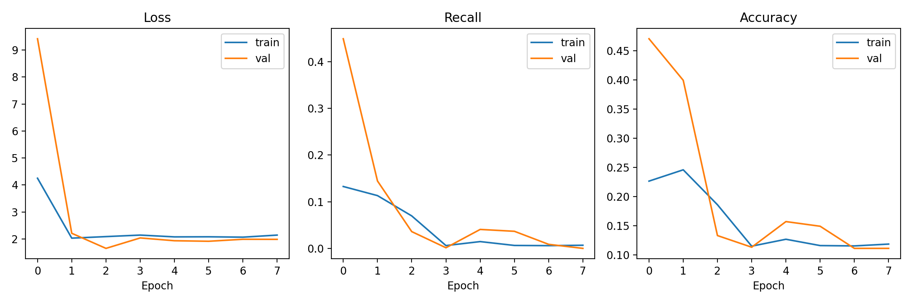

# Análise do baseline v1.0

O modelo baseline atingiu `recall_melanoma = 0.9820`, o que é um resultado forte para a métrica prioritária do projeto. Em termos clínicos, isso indica baixa taxa de falsos negativos para a classe `mel`, alinhando-se ao objetivo de não deixar lesões malignas passarem despercebidas.

Ao mesmo tempo, o desempenho agregado ainda é fraco em outras métricas: `recall_macro = 0.1455`, `precision_macro = 0.1552`, `f1_macro = 0.0389` e `roc_auc_ovr_macro = 0.6487`. Isso mostra que o modelo baseline está muito enviesado para a classe melanoma e ainda confunde bastante outras categorias, especialmente as benignas.

Conclusão: para a prioridade clínica definida na proposta, o recall de melanoma está aceitável no baseline. Porém, o modelo ainda não está equilibrado para uso geral, e a matriz de confusão deve ser usada para identificar quais classes benignas estão sendo confundidas com `mel` ou entre si antes de evoluir para uma versão melhorada.